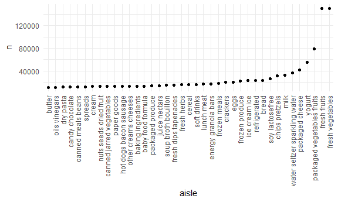
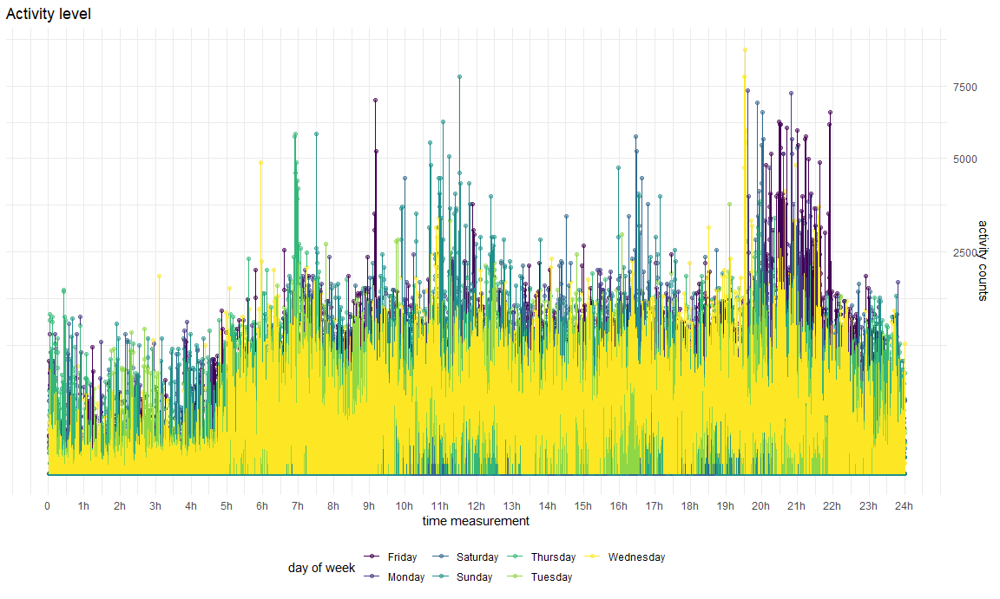
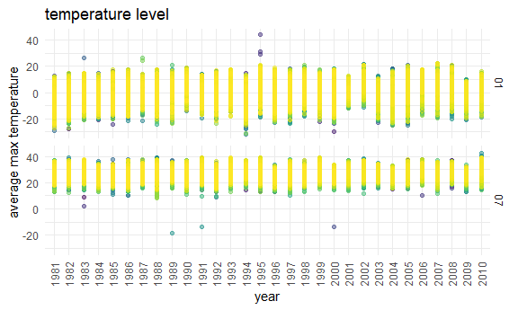
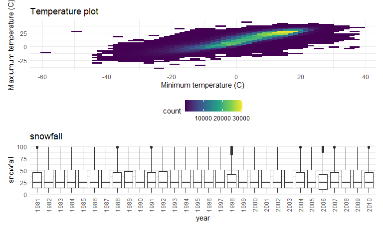

p8105\_hw3\_zw2709
================

## Problem 1

``` r
library(p8105.datasets)
data("instacart")
```

This dataset contains 1384617 rows and 15 columns.

Observations are the level of items in orders by user. There are user /
order variables – user ID, order ID, order day, and order hour. There
are also item variables – name, aisle, department, and some numeric
codes.

How many aisles, and which are most items from?

``` r
instacart %>% 
    count(aisle) %>% 
    arrange(desc(n))
```

    ## # A tibble: 134 x 2
    ##    aisle                              n
    ##    <chr>                          <int>
    ##  1 fresh vegetables              150609
    ##  2 fresh fruits                  150473
    ##  3 packaged vegetables fruits     78493
    ##  4 yogurt                         55240
    ##  5 packaged cheese                41699
    ##  6 water seltzer sparkling water  36617
    ##  7 milk                           32644
    ##  8 chips pretzels                 31269
    ##  9 soy lactosefree                26240
    ## 10 bread                          23635
    ## # ... with 124 more rows

Let’s make a plot

``` r
instacart %>% 
    count(aisle) %>% 
    filter(n > 10000) %>% 
    mutate(
        aisle = factor(aisle),
        aisle = fct_reorder(aisle, n)
    ) %>% 
    ggplot(aes(x = aisle, y = n)) + 
    geom_point() + 
    theme(axis.text.x = element_text(angle = 90, vjust = 0.5, hjust = 1))
```



Let’s make a table\!\!

``` r
instacart %>% 
    filter(aisle %in% c("baking ingredients", "dog food care", "packaged vegetables fruits")) %>% 
    group_by(aisle) %>% 
    count(product_name) %>% 
    mutate(rank = min_rank(desc(n))) %>% 
    filter(rank < 4) %>% 
    arrange(aisle, rank) %>% 
    knitr::kable()
```

| aisle                      | product\_name                                 |    n | rank |
| :------------------------- | :-------------------------------------------- | ---: | ---: |
| baking ingredients         | Light Brown Sugar                             |  499 |    1 |
| baking ingredients         | Pure Baking Soda                              |  387 |    2 |
| baking ingredients         | Cane Sugar                                    |  336 |    3 |
| dog food care              | Snack Sticks Chicken & Rice Recipe Dog Treats |   30 |    1 |
| dog food care              | Organix Chicken & Brown Rice Recipe           |   28 |    2 |
| dog food care              | Small Dog Biscuits                            |   26 |    3 |
| packaged vegetables fruits | Organic Baby Spinach                          | 9784 |    1 |
| packaged vegetables fruits | Organic Raspberries                           | 5546 |    2 |
| packaged vegetables fruits | Organic Blueberries                           | 4966 |    3 |

Apples vs ice cream..

``` r
instacart %>% 
    filter(product_name %in% c("Pink Lady Apples", "Coffee Ice Cream")) %>% 
    group_by(product_name, order_dow) %>% 
    summarize(mean_hour = mean(order_hour_of_day)) %>% 
    pivot_wider(
        names_from = order_dow,
        values_from = mean_hour
    )
```

    ## `summarise()` regrouping output by 'product_name' (override with `.groups` argument)

    ## # A tibble: 2 x 8
    ## # Groups:   product_name [2]
    ##   product_name       `0`   `1`   `2`   `3`   `4`   `5`   `6`
    ##   <chr>            <dbl> <dbl> <dbl> <dbl> <dbl> <dbl> <dbl>
    ## 1 Coffee Ice Cream  13.8  14.3  15.4  15.3  15.2  12.3  13.8
    ## 2 Pink Lady Apples  13.4  11.4  11.7  14.2  11.6  12.8  11.9

## Problem 2

### 1\)

First import the data. Then load, tidy and wrangle data.

``` r
data =
  read_csv('./data/accel_data.csv') %>% 
  janitor::clean_names() %>% 
  
  pivot_longer(
    activity_1 : activity_1440,
    names_to = 'activity_minute',
    names_prefix = 'activity_',
    values_to = 'activity_counts'
  ) 
```

    ## Parsed with column specification:
    ## cols(
    ##   .default = col_double(),
    ##   day = col_character()
    ## )

    ## See spec(...) for full column specifications.

    ## Warning in FUN(X[[i]], ...): strings not representable in native encoding will
    ## be translated to UTF-8

    ## Warning in FUN(X[[i]], ...): unable to translate '<U+00C4>' to native encoding

    ## Warning in FUN(X[[i]], ...): unable to translate '<U+00D6>' to native encoding

    ## Warning in FUN(X[[i]], ...): unable to translate '<U+00E4>' to native encoding

    ## Warning in FUN(X[[i]], ...): unable to translate '<U+00F6>' to native encoding

    ## Warning in FUN(X[[i]], ...): unable to translate '<U+00DF>' to native encoding

    ## Warning in FUN(X[[i]], ...): unable to translate '<U+00C6>' to native encoding

    ## Warning in FUN(X[[i]], ...): unable to translate '<U+00E6>' to native encoding

    ## Warning in FUN(X[[i]], ...): unable to translate '<U+00D8>' to native encoding

    ## Warning in FUN(X[[i]], ...): unable to translate '<U+00F8>' to native encoding

    ## Warning in FUN(X[[i]], ...): unable to translate '<U+00C5>' to native encoding

    ## Warning in FUN(X[[i]], ...): unable to translate '<U+00E5>' to native encoding

Increase a new variable.

``` r
data_ = mutate(
  data,
  vs = case_when(
    day %in% c('Monday', 'Tuesday', 'Wednesday', 'Thursday', 'Friday') ~'weekday',
    day %in% c('Saturday', 'Sunday') ~'weekend',
    TRUE ~ ''
  ) 
)
```

Then we encode the data and show them in order

We need to change the variable classes.

``` r
data_classes = 
  data_ %>% 
  mutate(
    activity_minute = as.numeric(activity_minute),
    activity_counts = as.numeric(activity_counts),
    week = as.numeric(week),
    day_id = as.numeric(day_id),
    day = as.character(day),
    vs = as.character(vs)
    
  )
```

Have another ‘day\_df’ variable whose class is integer to denote the
‘day’ character, so that the order based on week and day would be
satisfied.

``` r
day_df = 
  tibble(
    day_number = 1:7,
    day = c('Monday', 'Tuesday', 'Wednesday', 'Thursday', 'Friday', 'Saturday', 'Sunday')
  )

data_new = 
  left_join(data_classes, day_df, by = 'day') %>% 
  relocate(week, day, vs) %>% 
  arrange(week, day_number) %>% 
  select(-day_number) 
```

As is shown in ‘data\_new’, there are six variables in total:week, day,
vs, day\_id, activity\_minute, activity\_counts

The variable ‘day’,‘vs’,‘activity\_name’ are characters and the
remaining are numerical measures.

The dataset has 50400 rows, and has 50400 observations.

### 2\)

Create a table

``` r
data_new %>% 
  group_by(week, day) %>% 
  summarize(sum_activity_counts = sum(activity_counts)) %>% 
  pivot_wider(
    names_from = week, 
    values_from = sum_activity_counts
  ) %>% 
  knitr::kable()
```

    ## `summarise()` regrouping output by 'week' (override with `.groups` argument)

| day       |         1 |      2 |      3 |      4 |      5 |
| :-------- | --------: | -----: | -----: | -----: | -----: |
| Friday    | 480542.62 | 568839 | 467420 | 154049 | 620860 |
| Monday    |  78828.07 | 295431 | 685910 | 409450 | 389080 |
| Saturday  | 376254.00 | 607175 | 382928 |   1440 |   1440 |
| Sunday    | 631105.00 | 422018 | 467052 | 260617 | 138421 |
| Thursday  | 355923.64 | 474048 | 371230 | 340291 | 549658 |
| Tuesday   | 307094.24 | 423245 | 381507 | 319568 | 367824 |
| Wednesday | 340115.01 | 440962 | 468869 | 434460 | 445366 |

The table reflects data about 7 days of one week and the total 5 weeks,
and the data were the total number of the activity counts.

For the first two weeks, the most active activity counts are during
weekends(Sunday for week 1, Saturday for week 2). For the remaing three
weeks, the most active activities counts occur during the weekdays.

For week 4 and week 5, the activity level for Saturday seems to be low
compared with others.

### 3\)

The single-panel plot would have x axis of the 24 hours with the
measurement of time, and would have y axis of the activity counts. Then
we use different colors of lines to represent different days of the
week.

``` r
data_plot = 
  data_new %>% 
  ggplot(aes(x = activity_minute, y = activity_counts, color = day)) +
  geom_point(alpha = 0.5) +
  labs(
    title = "Activity level",
    x = "time measurement",
    y = "activity counts"
  ) + 
  
  scale_x_continuous(
    breaks = c(0,60,120,180,240,300,360,420,480,540,600,660,720,780,840,900,960,1020,1080,1140,1200,1260,1320,1380,1440),
    labels = c("0","1h","2h","3h","4h","5h","6h","7h","8h","9h","10h","11h","12h","13h","14h","15h","16h","17h","18h","19h","20h","21h","22h","23h","24h")
  ) +

  scale_y_continuous(
  
    trans = "sqrt", 
    position = "right"
  ) + 
  geom_line() +
  
  viridis::scale_color_viridis(
    name = 'day of week',
    discrete = TRUE) +
  theme_minimal()+
  theme(legend.position = 'bottom')
```

``` r
data_plot
```



From the perspective of 24 hours in a day, the midnight time would have
low level of activity level (midnight to about 6 o’clock). The time
period between 20 p.m. to 22 p.m. at night seem to have higher values of
activity counts and are regarded to be active.

From the weekdays, it seems that the peak activity time of 20 p.m. to 22
p.m. occurs frequently for Friday, meaning the relative active status of
Friday night.

## Problem 3

import data

``` r
library(p8105.datasets)
data("ny_noaa")
```

The dataset contains information about core variables for all New York
state weather stations during some time period.

The variables contained are id, date, prcp, snow, snwd, tmax, tmin. So
the key variables besides ‘id’ and ‘date’ are: prcp, snow, snwd, tmax,
tmin, which are some key weather variables of the stations.

These five variables all contain missing values, and the number of
missing values are as follows: prcp: 145838; snow: 381221; snwd: 591786;
tmax: 1134358; tmin: 1134420.

Overall, the ‘tmax’ and ‘tmin’ contain a relatively high level of
missing values, might reduce the accuracy of result to some extent.

The dataset has 2595176 rows and 7 columns, so the size of dataset is
2595176 \* 7.

### 1\)

data cleaning

``` r
ny_data = 
  ny_noaa %>% 
  drop_na() %>% 
  mutate(date, date = as.character(date)) %>% 
  separate(date, into = c('year', 'month', 'day')) %>% 
  
  mutate(prcp, prcp = as.numeric(prcp)) %>% 
  mutate(snow, snow = as.numeric(snow)) %>% 
  mutate(snwd, snwd = as.numeric(snwd)) %>% 
  mutate(tmax, tmax = as.numeric(tmax)) %>% 
  mutate(tmin, tmin = as.numeric(tmin))
```

Since ‘prcp’ measures Precipitation (tenths of mm), ‘tmax’ and ‘tmin’
measures temperatures in tenths of degrees C, so we divide each value by
ten to get reasonable units.

``` r
ny_data_ = 
  ny_data %>% 
  mutate(
    tmax = tmax / 10,
    tmin = tmin / 10, 
    prcp = prcp / 10
  )
```

For snowfall, the most commonly observed values are 0 with the number of
111758, meaning the station did not have snow during specific period.

``` r
ny_data_ %>% 
  count(snow) %>% 
    arrange(desc(n)) 
```

    ## # A tibble: 248 x 2
    ##     snow       n
    ##    <dbl>   <int>
    ##  1     0 1112758
    ##  2    25   15809
    ##  3    13   12460
    ##  4    51    9252
    ##  5     5    5669
    ##  6     8    5380
    ##  7    76    5296
    ##  8     3    5276
    ##  9    38    5050
    ## 10   102    3386
    ## # ... with 238 more rows

### 2\)

Make the two-panel plot.

The plot may consist of two sub-plots for January and July. For each
sub-plot, the x-axis is measurement of years denoted by ‘year’, and the
y-axis is the average max temperatures denoted by ‘tmax’, and the color
of the lines represent different stations.

``` r
ny_data_ %>% 
  filter(month %in% c('01','07')) %>% 
  group_by(year, id, month, tmax) %>% 
  summarize(
    mean_tmax = mean(tmax, na.rm = TRUE)
  ) %>% 

  ggplot(aes(x = year, y = mean_tmax, color = id))+
  geom_point(alpha = 0.5)+
  geom_smooth(se = FALSE) +
  labs(
    title = "temperature level",
    x = "year",
    y = "average max temperature"
  ) + 

  theme(axis.text.x = element_text(angle = 90, vjust = 0.5, hjust = 1))+
  theme(legend.position = 'none') +
  facet_grid(month ~ .)
```

    ## `summarise()` regrouping output by 'year', 'id', 'month' (override with `.groups` argument)

    ## `geom_smooth()` using method = 'loess' and formula 'y ~ x'



It is observed that the average max temperatures in July (around 20-40
degrees)is higher than that in January (around -20-20 degrees).

The range of temperatures (max-min) in January seems to be larger than
that of July, meaning more changes in max temperature and unstable
status.

There are some outliers both for the two months. The outliers in January
seem to be seen obviously seen at around 1995 for over 20 degrees.

The outliers in July are usually lower than the average level, and some
obvious ouliers occur at about 1989,1991 and 2000.

### 3\)

Then make the two-panel plot.

For the first plot, it is tmax vs tmin for the full dataset.

For the second plot showing the distribution of snowfall values greater
than 0 and less than 100 separately by year.

Then we need to combine two sub-plots to get the two-panel plot.

``` r
library(patchwork)

temp = 
  ny_data_ %>% 
  ggplot(aes(x = tmin, y = tmax)) +
  geom_hex()+
  labs(
    title = "Temperature plot",
    x = "Minimum temperature (C)",
    y = "Maxiumum temperature (C)"
  ) +
  viridis::scale_color_viridis(
    name = 'Location',
    discrete = TRUE)


snowfall = 
  ny_data_ %>% 
  filter(snow > 0 & snow < 100) %>% 
  ggplot(aes(x = year, y = snow)) +   #x为name，显示三个图
  geom_boxplot()+
  labs(
    title = "snowfall",
    x = "year",
    y = "snowfall"
  ) +
  theme(axis.text.x = element_text(angle = 90, vjust = 0.5, hjust = 1))
  
temp_snowfall_plot = temp / snowfall
```

``` r
temp_snowfall_plot
```


